#  Bodelschwinger Hof

(Developer: Ana Runje)

[Live webpage](https://4n4ru.github.io/CI_MS1_BodelschwingherHof/)

##  Table of Content

1. [Project Goals](#project-goals)

1. [User Goals](#user-goals)

2. [Site Owner Goals](#site-owner-goals)

2. [User Experience](#user-experience)

1. [Target Audience](#target-audience)

2. [User Requrements and Expectations](#user-requrements-and-expectations)

3. [User Stories](#user-stories)

3. [Design](#design)

1. [Design Choices](#design-choices)

2. [Colour](#colours)

3. [Fonts](#fonts)

4. [Structure](#structure)

5. [Wireframes](#wireframes)

4. [Technologies Used](#technologies-used)

1. [Languages](#languages)

2. [Frameworks & Tools](#frameworks-&-tools)

5. [Features](#features)

6. [Testing](#validation)

1. [HTML Validation](#HTML-validation)

2. [CSS Validation](#CSS-validation)

3. [Accessibility](#accessibility)

4. [Performance](#performance)

5. [Device testing](#performing-tests-on-various-devices)

6. [Browser compatibility](#browser-compatability)

7. [Testing user stories](#testing-user-stories)

9. [Deployment](#deployment)

10. [Credits](#credits)

##  Project Goals

###  User Goals

-   Discovering a restaurant that provides both a pleasant ambiance and delicious cuisine.
-   Accessing a comprehensive menu that displays pricing in a clear and concise manner.
-   Obtaining details about the restaurant, such as its history, reviews, and ratings.
-   Locating the physical address and directions to the restaurant's establishmen

###  Site Owner Goals

- Increase in the number of customers.

- Promote the bussines.

- Provide a way for new and existing customers to contact the business.

- Provide essential information about the bussines to customers.

##  User Experience

###  Target Audience

-   Individuals searching for a dining venue

-   Individuals interested in placing a takeout order

-   Groups seeking a location to host a catered event

-   Small to medium-sized wedding groups

###  User Requrements and Expectations

-   A navigation system that is easy to use and understand.
-   Quickly and effortlessly locate the information you need.
-   Links and features that perform as expected.
-   Visually attractive design and layout that works well on all screen sizes.
-   A straightforward method for contacting the business.
-   Content that is easy to skim and understand.
-   Availability for all users, including those with disabilities.

###  User Stories

####  First-time User

1.  As a new visitor, I would like to easily find the restaurant's location.

2.  As a first-time customer, I want to know the pricing options available at the restaurant.

3.  As a newcomer, I would like to discover additional information about the restaurant.

4.  As a first-time visitor, I want to have an idea of what to expect during my visit to the restaurant.

####  Returning User

    
6.  I want to be informed about the opening hours as a returning user.
    
7.  I want to locate a phone number to make a reservation as a returning user.
    
8.  As a returning user, I want to browse the menu.
    
9.  I want to provide feedback, suggestions, or a message to the restaurant's staff as a returning user.
    
10.  I want to find the restaurant on social media as a returning user.
    

    
12.  As a returning user, I want to access directions to the restaurant.

####  Site Owner

    
14.  As the site owner, I want users to access the site and learn more about the restaurant 
    
15.  Ensuring that users can easily contact us is a priority for me as the site owner.
16. 
##  Design

###  Design Choices

-   Since Tavern is located on a sea coast, I added a lot of blue to the website.
-   I tried to show how easy, calm, and relaxed the experience at Rhodes Restaurant is.
-   I made the page simple for the user, so the user could take action by contacting the restaurant to book a table.

###  Fonts

During the design development, I used the following list of fonts: Lato, Oswald, sans-serif, Arial.

 

-   I use Lato as the default font for the **body** on all pages.
-   Oswald is used for the logo.
-   Arial font was used for **h2**, **p**, and **body** of the booking page.
 Sans-serif is used as a backup.

###  Structure

The page is structured in a well know, recognizable, user friendly, and easy to learn way. Upon arriving to the website the user sees a familiar type of navigation bar with the restaurant logo on the left side and the navigation links to the right.

The website consists of five separate pages:

- A homepage with a sections for News and Sunday Meal Offers

- An about page with the About Us and Meet the Chef

- A menu page

- A image gallery with images and video showcasing the general feel of the restaurant

- A contact page with a contact form, a map and information about the bussines section

###  Wireframes

Home

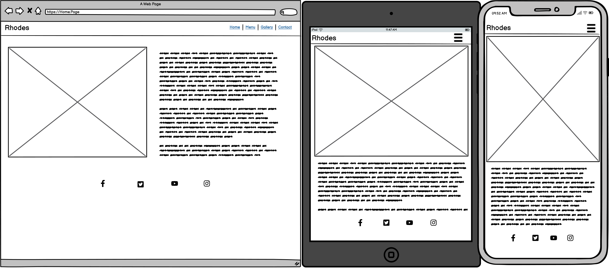

Menu

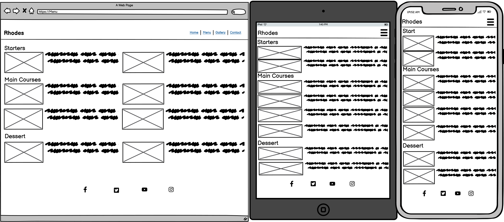

Gallery

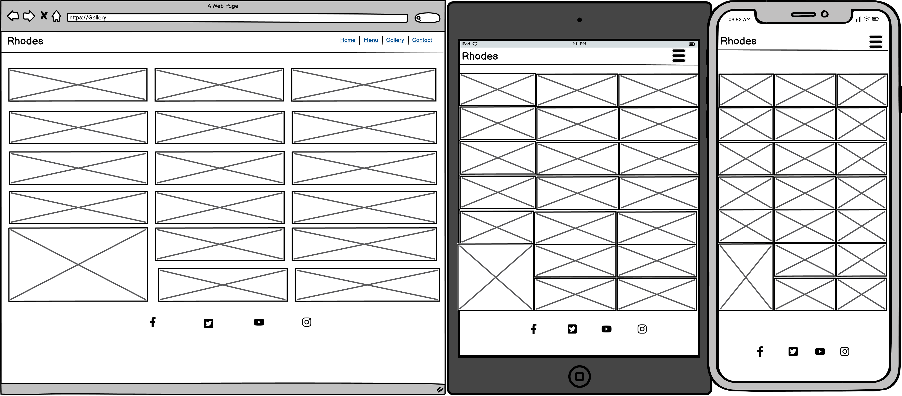

Contact

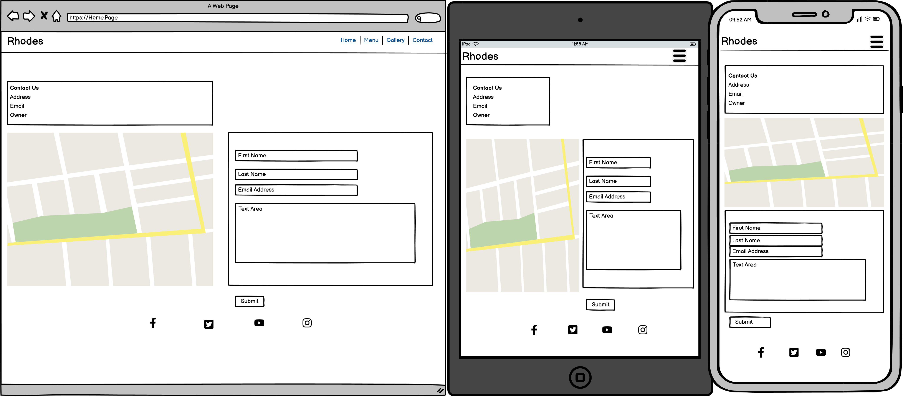

##  Technologies Used

###  Languages

- HTML

- CSS

###  Frameworks & Tools

- Git

- GitHub

- Gitpod

- Tinypng

- Balsamiq

- Google Fonts

- Font Awsome 

##  Features
<!-- the last save -->
The website comprises four pages and <NUMBER> functionalities.

###  Logo and Navigation Bar

- Displayed on each of the five pages.

- The navigation bar is completely adaptable and transforms into a hamburger menu on smaller displays.

- The hyperlink for the current page the user is viewing is emphasized.

###  Footer

- Displayed on each of the five pages.

- Consists of four icons: Facebook, Twitter, YouTube, Instagram. Each icon is linked to a hyperlink.

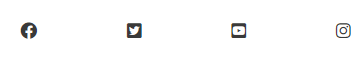

<!-- the last save -->

###  Home Page

- Gives a description of the restaurant with a image of the dining area next to the sea. 

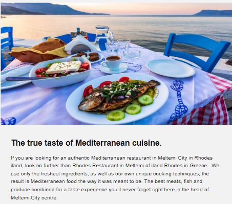

###  Menu

- The menu is divided into three sections: Starters, Main Courses, and Desserts.

- Each showcasing a picture of one of the items on offer. 

- Additionally, the menu includes pricing information for each item.

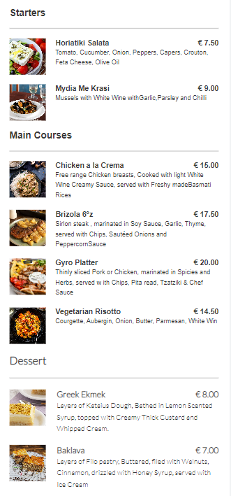

###  Contact Page

Contact page has three section:
a) Info Box.
b) Google Map.
c) Contact Form.

###  Image Gallery

- Gallery section shows dishes, great view of the restaurant and user experience.

- The pictures of the restaurant are presented in a grid layout.

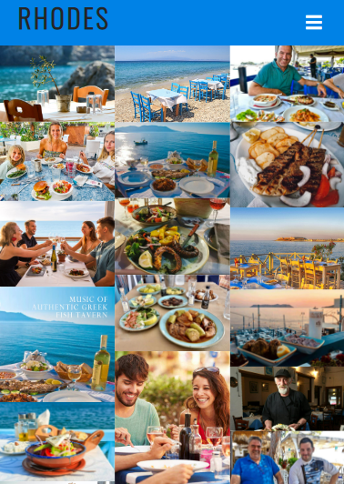

###  Info Box

- The user is furnished with details about the restaurant such as its address, phone number, email, and the name of its proprietor.

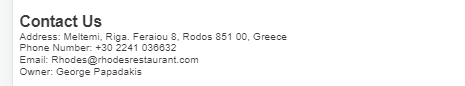

###  Contact Form

- A way for users to send an email to a restaurant to book a table or leave feedback.

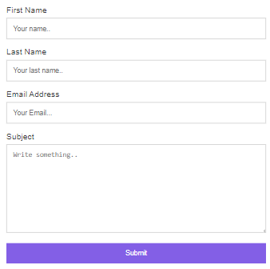

###  Map

- Displays the restaurant's location using an embedded Google Map.

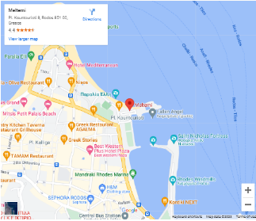

##  Validation

###  HTML Validation

We utilized the W3C Markup Validation Service to validate the HTML of our website. The Home and Menu pages passed without errors; however, the Gallery and Contact pages returned warnings and errors. Based on my assessment, I deem these errors to be false positives. I have added comments to each section to provide justification for my conclusion.

Home

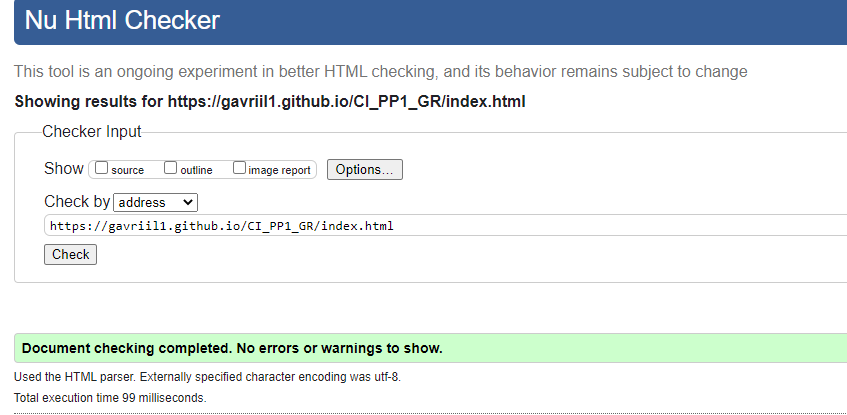

Menu

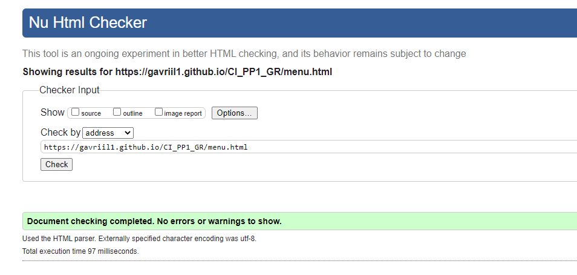

Gallery

An error was detected on the 'Gallery' page, which has been attributed to the methodology utilized by the lecturer in the CodeInstitute example. Despite the warning, we have opted to retain the existing structure, and therefore, we will not convert the section to a div

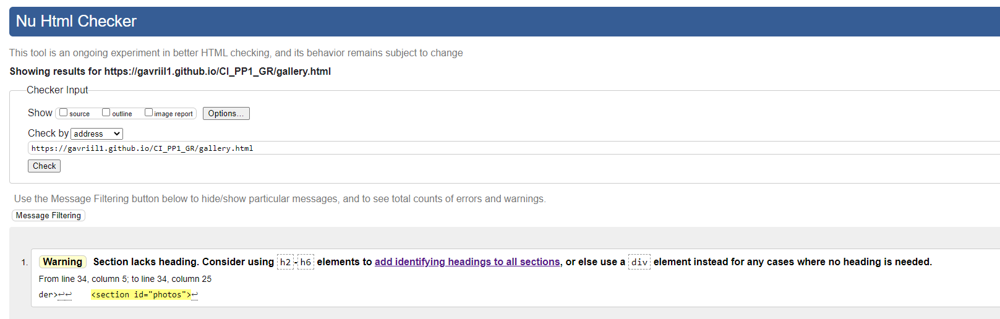

Contact

Two errors have been identified on this page; however, after thorough investigation, we believe that both are false positives. It is not feasible to modify the '100%' value to '100' as it would cause page breakage. Additionally, the use of 'px' in height is an acceptable CSS method, as outlined by the W3C CSS specification (https://developer.mozilla.org/en-US/docs/Web/CSS/height). Consequently, we have made a decision to disregard these errors and consider them as false positives.

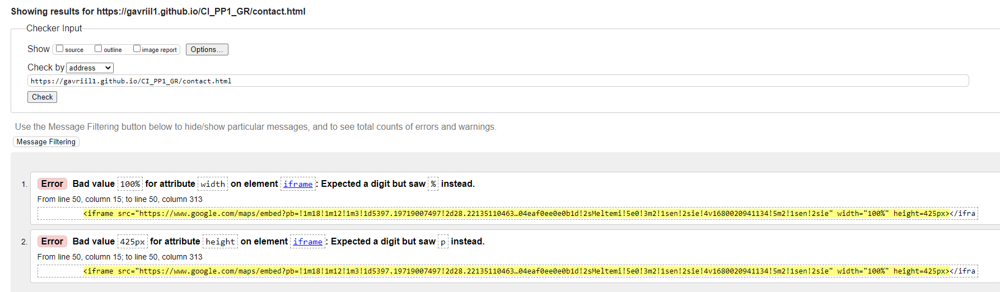

###  CSS Validation

The CSS of the website was validated using the W3C Jigsaw CSS Validation Service, which yielded no errors.

whole page

CSS Home page validation: No Errors
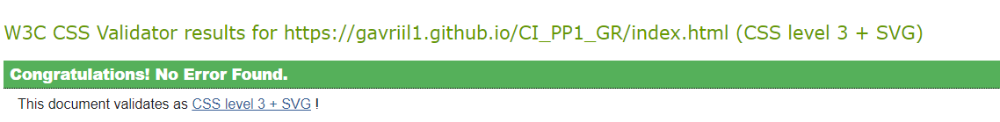
CSS Menu page validation: No Errors
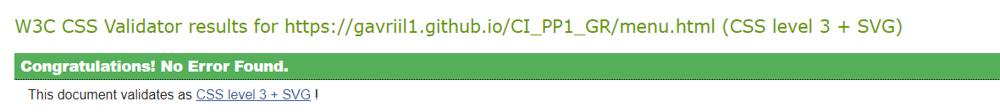
CSS Gallery page validation: No Errors
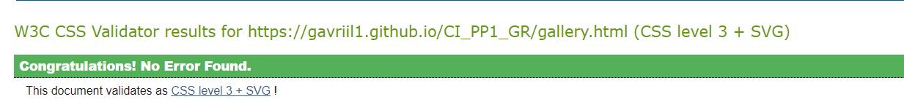
CSS Contact page validation: No Errors
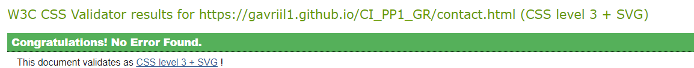

style.css

Upon examination, no CSS errors were detected in the CSS.style document.

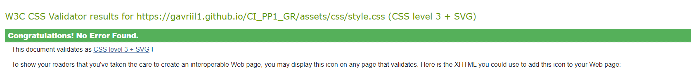

###  Accessibility

The WAVE WebAIM web accessibility evaluation tool was used to ensure the website met high accessibility standards.

Home

On this page, we have identified 5 errors and 1 alert. 

The first error is "Empty Form Label." However, this is a false positive error since the form is not visible to the user. The form is actually added to create a hamburger menu. Therefore, "Empty Form Label" is a false positive error.

We have also identified 4 "Contrast Errors," but the content of the site navigation bar is actually quite visible. For this reason, these errors are also false positives.

Finally, we have identified 1 "Redundancy Link" alert. This is because the logo of the page and the home page have exactly the same hyperlink. However, this is part of the initial website design, so it is also a false positive error.

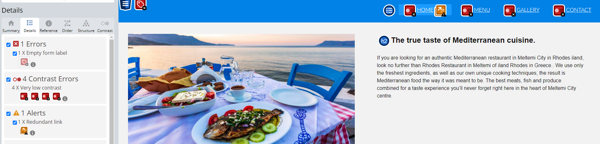

Menu

We have identified the presence of similar errors on the Menu page as those found on the Home page. As a result, we recommend accessing the Home Accessibility section to review any notes or information pertaining to these errors

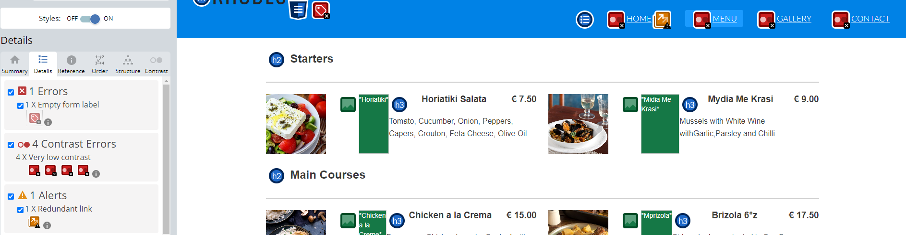

Gallery

We have identified the presence of similar errors on the Gallery page as those found on the Home page. As a result, we recommend accessing the Home Accessibility section to review any notes or information pertaining to these errors

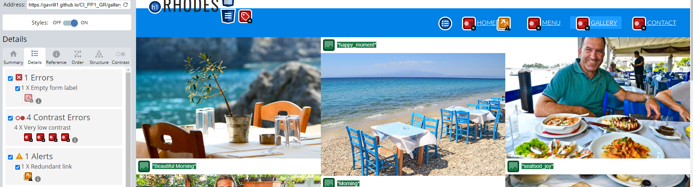

Contact

While reviewing this particular page, we have identified a newly surfaced error that was not present on the Home, Menu, or Gallery pages. Specifically, there appears to be a 'Contrast Error' that pertains to the 'Submit' button located within the Contact Form.

 It should be noted, however, that upon further examination, this appears to be a false positive as the button and accompanying text are clearly visible.

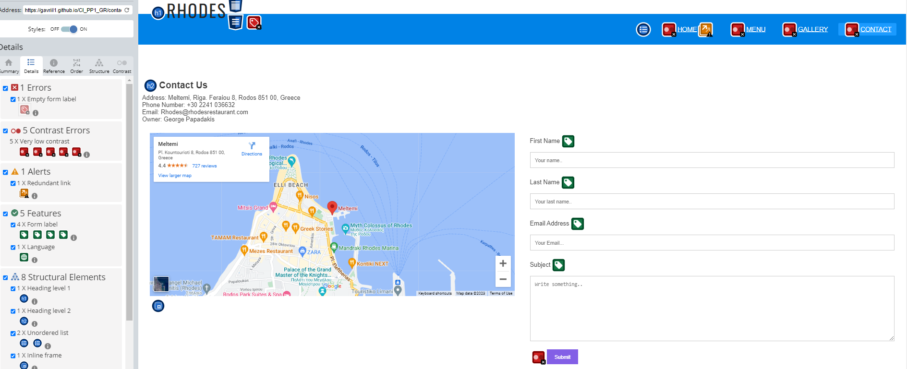

###  Performance

Google Lighthouse in Google Chrome Developer Tools was used to test the performance of the website.

Home

Screenshot of Desktop performance of Home page in Google Lighthouse.

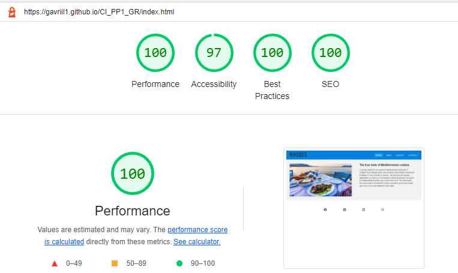

Screenshot of Mobile performance of Home page in Google Lighthouse.

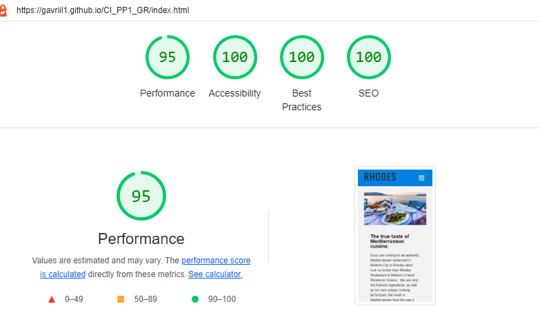

Menu

Screenshot of Desktop performance of Menu page in Google Lighthouse.

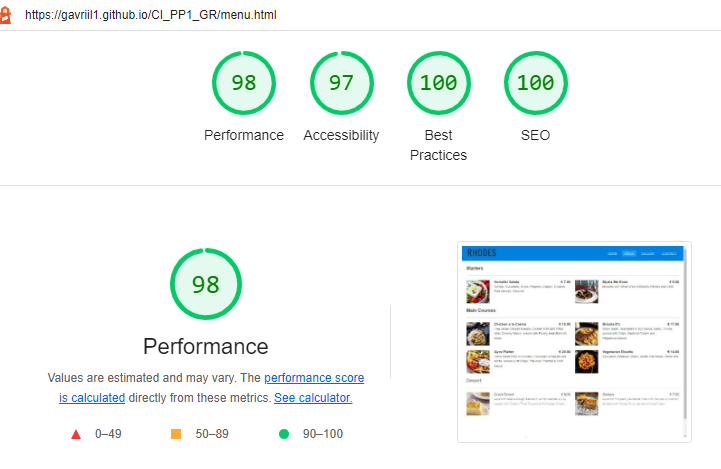

Screenshot of Mobile performance of Menu page in Google Lighthouse.

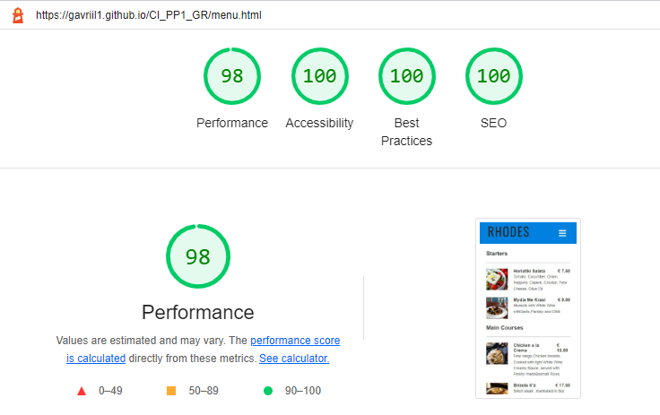

Gallery

Screenshot of Desktop performance of Gallery page in Google Lighthouse.

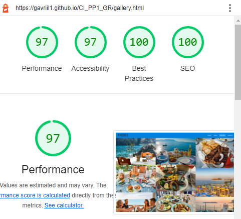

Screenshot of Mobile performance of Gallery page in Google Lighthouse.

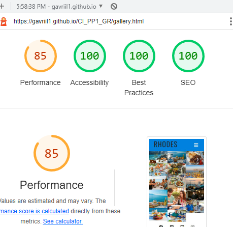

Contact

Screenshot of Desktop performance of Contact page in Google Lighthouse.

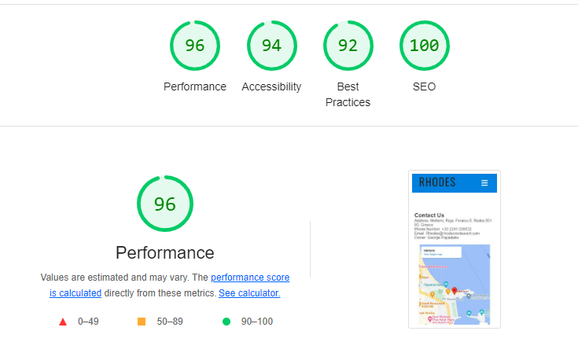

Screenshot of Mobile performance of Contact page in Google Lighthouse.

###  Performing tests on various devices

The website was tested on the following devices:

- Latitude 5520

- Redmi Note 10

- Samsung Tablet A10.1

Furthermore, the website underwent testing using the Device Toggling feature of Google Chrome Developer Tools, which includes all available device options.

###  Browser compatability

The following browsers were used to test the website:

- Google Chrome

- Mozilla Firefox

- Microsoft Egde

###  Testing user stories

1. As a new visitor, I would like to easily find the restaurant's location.

| **Feature** | **Action** | **Expected Result** | **Actual Result** |
|-------------|------------|---------------------|-------------------|
| Map | Navigate to the Contact Us page, locate the Google Map | Finding a map that displays the whereabouts of the restaurant. | Works as expected |

Screenshots

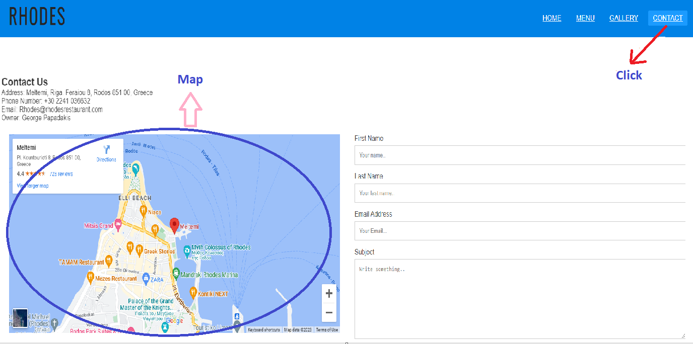

2. As a first-time customer, I want to know the pricing options available at the restaurant.

| **Feature** | **Action** | **Expected Result** | **Actual Result** |
|-------------|------------|---------------------|-------------------|
| Menu | Navigate to the Menu page | See the prices for each menu option | Works as expected |

Screenshots

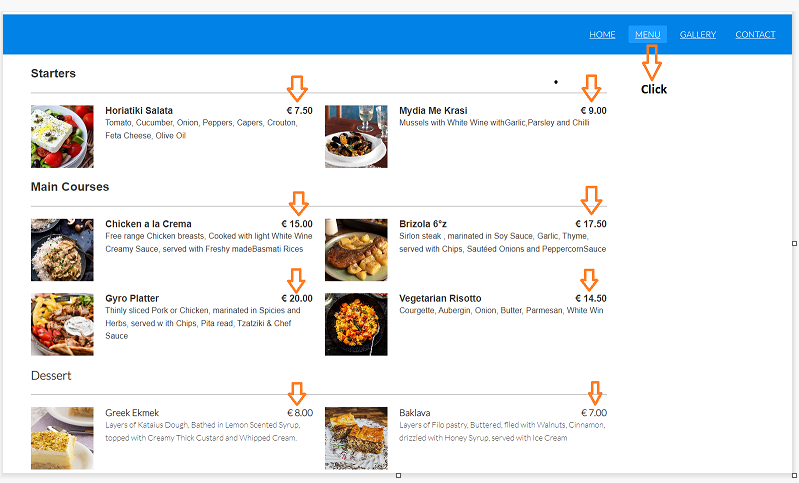

3. As a first time user, I want to know more about the restaurant

| **Feature** | **Action** | **Expected Result** | **Actual Result** |
|-------------|------------|---------------------|-------------------|
| Home | Navigate to the Home page and locate restaurant descprition | Find view of the restaurant and its description | Works as expected |

Screenshots

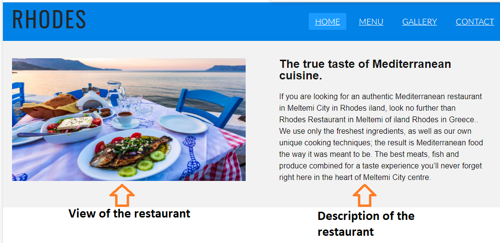

4. As a first-time visitor, I want to have an idea of what to expect during my visit to the restaurant.

| **Feature** | **Action** | **Expected Result** | **Actual Result** |
|-------------|------------|---------------------|-------------------|
| Gallery | Navigate to the Gallery page | Find pictures of the food, beautiful panoramas, and customer experiences. | Works as expected |

Screenshots

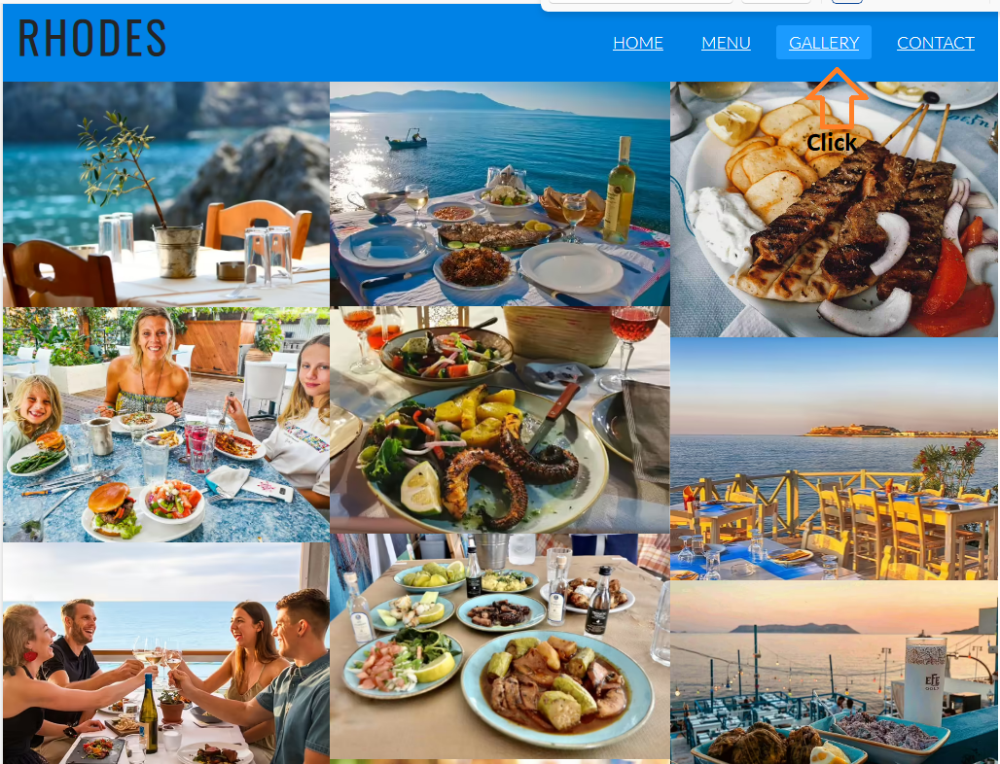

6. I want to be informed about the opening hours as a returning user.

| **Feature** | **Action** | **Expected Result** | **Actual Result** |
|-------------|------------|---------------------|-------------------|
| Info Box| Contact page -> Infor Box -> Opening hours  | See opening hours | Works as expected |

Screenshots

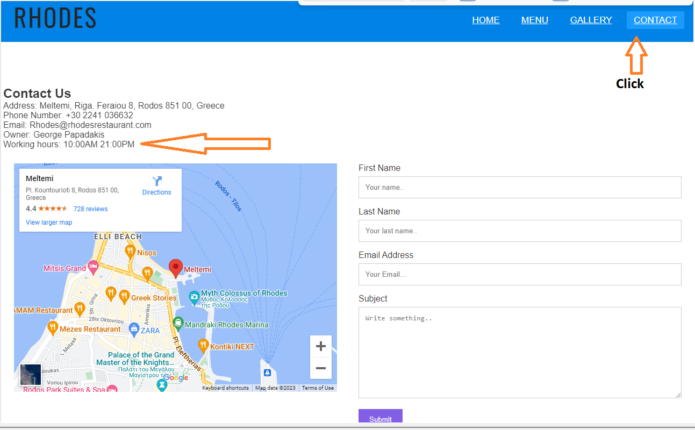

7. As a returning user, I want to find a phone number to call for reservation

| **Feature** | **Action** | **Expected Result** | **Actual Result** |
|-------------|------------|---------------------|-------------------|
| Info Box | Contact Page -> Info Box-> Search for Phone number | See phone number | Works as expected |

Screenshots

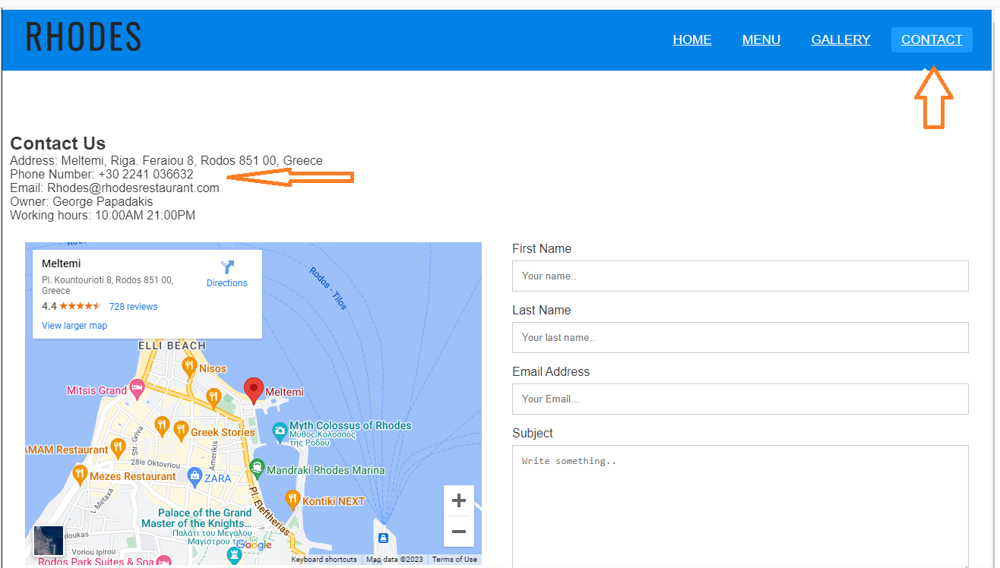

8. As a returning user, I want to see the menu

| **Feature** | **Action** | **Expected Result** | **Actual Result** |
|-------------|------------|---------------------|-------------------|
| Menu | Navigate to the menu page | Read the menu | Works as expected |

Screenshots

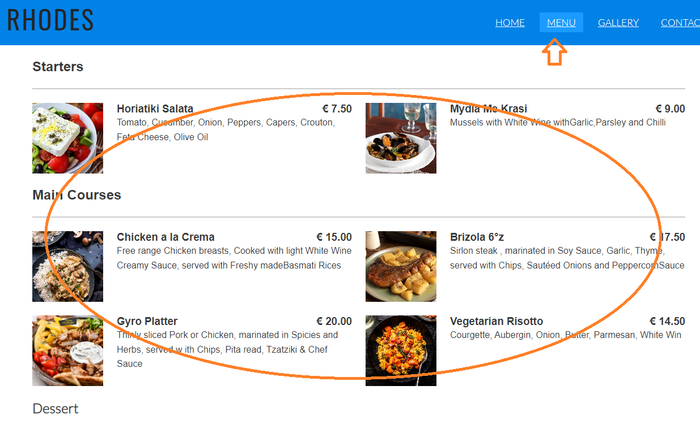

9. I want to provide feedback, suggestions, or a message to the restaurant's staff as a returning user.

| **Feature** | **Action** | **Expected Result** | **Actual Result** |
|-------------|------------|---------------------|-------------------|
| Contact Form | Please go to the Contact Us Page and find the contact form. Complete the form with your information and send it.| Data submited via contact form | Works as expectd |

Screenshots

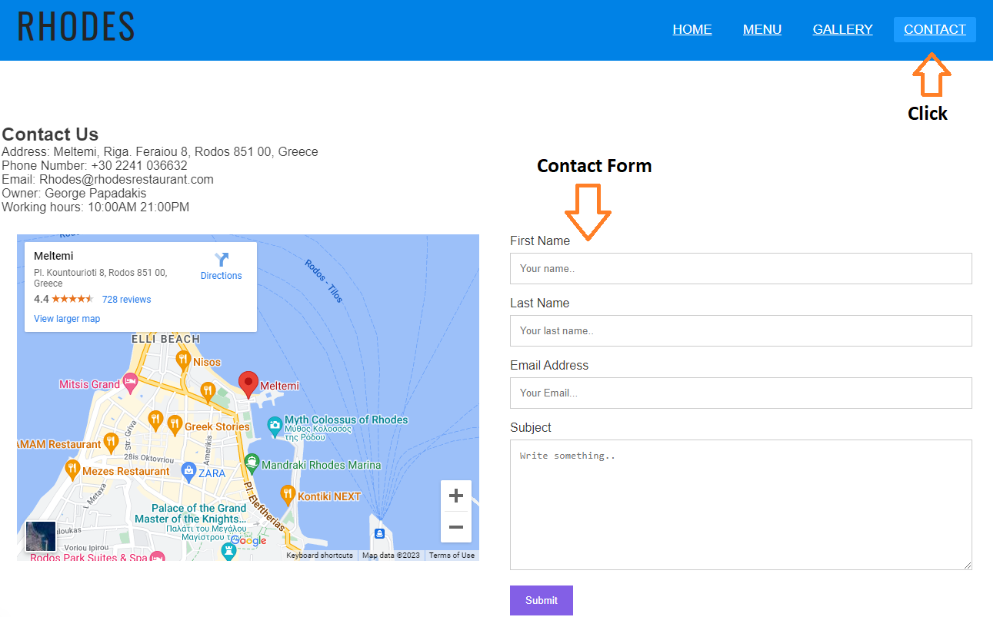

10. I want to find the restaurant on social media as a returning user.

| **Feature** | **Action** | **Expected Result** | **Actual Result** |
|-------------|------------|---------------------|-------------------|
| Footer  | On any page scroll to the bottom | Click on social media links | Works as expected |

Screenshots

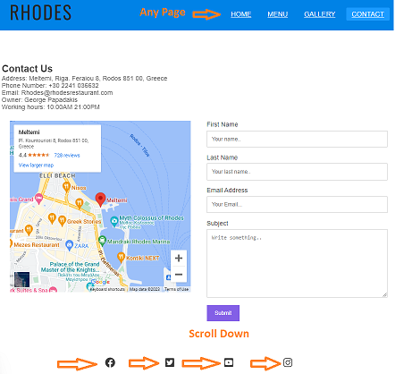

12. As a returning user, I want to get directions to the restaurant

| **Feature** | **Action** | **Expected Result** | **Actual Result** |
|-------------|------------|---------------------|-------------------|
| Map | Contact Page -> Google Map ->  click on directions link | View the restaurant's directions on Google Maps.| Works as expected |

Screenshots

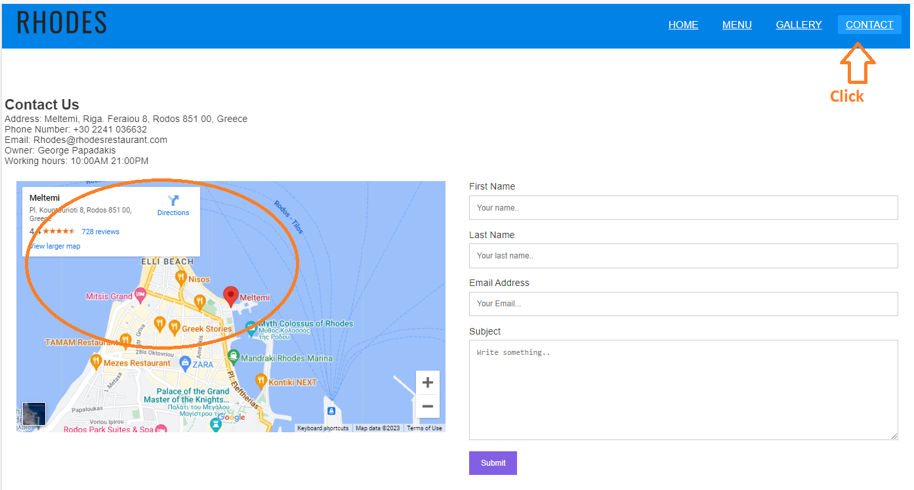

14. As the site owner, I want users to get to know the restaurant

| **Feature** | **Action** | **Expected Result** | **Actual Result** |
|-------------|------------|---------------------|-------------------|
| Home Page| Navigate to Home Page | View the restaurant's panorama and read its description. | Works as expected |

Screenshots

15. As the site owner, I want users to find our contact details to contact us or contact us through contact form.

| **Feature** | **Action** | **Expected Result** | **Actual Result** |
|-------------|------------|---------------------|-------------------|
| Contact Form | Contact Page -> Contact Form -> Enter text -> Submit | Data submited via contact form | Works as expectd |
| Info Box | Contact page -> Infor Box -> Find Phone and Email | Find the phone number, Email  | Works as expected |

Screenshots

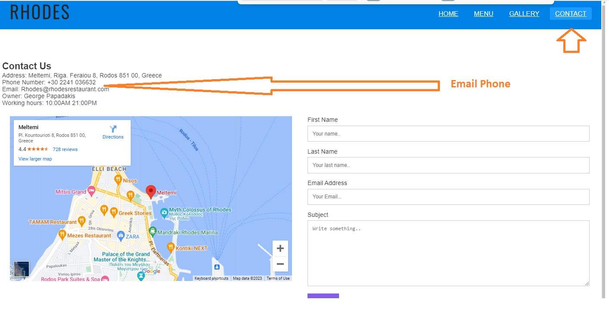

##  Deployment

The website was deployed using GitHub Pages by following these steps:

1. In the GitHub repository navigate to the Settings tab

2. On the left hand menu select Pages

3. For the source select Branch: master

4. After the webpage refreshes automaticaly you will se a ribbon on the top saying: "Your site is published at https://4n4ru.github.io/CI_MS1_BodelschwingherHof/"

You can for fork the repository by following these steps:

1. Go to the GitHub repository

2. Click on Fork button in upper right hand corner

You can clone the repository by following these steps:

1. Go to the GitHub repository

2. Locate the Code button above the list of files and click it

3. Select if you prefere to clone using HTTPS, SSH, or Github CLI and click the copy button to copy the URL to your clipboard

4. Open Git Bash

5. Change the current working directory to the one where you want the cloned directory

6. Type git clone and paste the URL from the clipboard ($ git clone https://github.com/YOUR-USERNAME/YOUR-REPOSITORY)

7.Press Enter to create your local clone.

##  Credits

Images not referenced below are owned by the developer.

###  Media

In order of apearance:

- [carousel-1](assets/images/carousel-1.jpg): Photo by <a href="https://unsplash.com/@heathergill?utm_source=unsplash&utm_medium=referral&utm_content=creditCopyText">Heather Gill</a> on <a href="https://unsplash.com/s/photos/pots-and-pans?utm_source=unsplash&utm_medium=referral&utm_content=creditCopyText">Unsplash</a>

- [news](assets/images/news.jpg): Photo by <a href="https://unsplash.com/@mareksminder?utm_source=unsplash&utm_medium=referral&utm_content=creditCopyText">Claudia Altamimi</a> on <a href="https://unsplash.com/?utm_source=unsplash&utm_medium=referral&utm_content=creditCopyText">Unsplash</a>

- [meal-deal](assets/images/meal-deal.jpg): Photo by <a href="https://unsplash.com/@itssammoqadam?utm_source=unsplash&utm_medium=referral&utm_content=creditCopyText">Sam Moqadam</a> on <a href="https://unsplash.com/?utm_source=unsplash&utm_medium=referral&utm_content=creditCopyText">Unsplash</a>

- [chef](assets/images/chef.jpg): <a href='https://www.freepik.com/photos/food'>Food photo created by freepik - www.freepik.com</a>

- [menu background](assets/images/menu-background.jpg): <a href="https://www.freepik.com/vectors/background">Background vector created by pikisuperstar - www.freepik.com</a>

- [starter](assets/images/starter.jpg) Photo by <a href="https://unsplash.com/@margzu?utm_source=unsplash&utm_medium=referral&utm_content=creditCopyText">Margarita Zueva</a> on <a href="https://unsplash.com/?utm_source=unsplash&utm_medium=referral&utm_content=creditCopyText">Unsplash</a>

- [main meal](assets/images/main-meal.jpg) Photo by <a href="https://unsplash.com/@keriliwi?utm_source=unsplash&utm_medium=referral&utm_content=creditCopyText">Keriliwi</a> on <a href="https://unsplash.com/?utm_source=unsplash&utm_medium=referral&utm_content=creditCopyText">Unsplash</a>

- [kids meal](assets/images/kids-meal.jpg) Photo by <a href="https://unsplash.com/@itssammoqadam?utm_source=unsplash&utm_medium=referral&utm_content=creditCopyText">Sam Moqadam</a> on <a href="https://unsplash.com/?utm_source=unsplash&utm_medium=referral&utm_content=creditCopyText">Unsplash</a>

- [dessert](assets/images/dessert.jpg) Photo by <a href="https://unsplash.com/@almapapi?utm_source=unsplash&utm_medium=referral&utm_content=creditCopyText">Krisztina Papp</a> on <a href="https://unsplash.com/?utm_source=unsplash&utm_medium=referral&utm_content=creditCopyText">Unsplash</a>

- [wine](assets/images/wine.jpg) Photo by <a href="https://unsplash.com/@biljaminai?utm_source=unsplash&utm_medium=referral&utm_content=creditCopyText">Biljana Martinic</a> on <a href="https://unsplash.com/?utm_source=unsplash&utm_medium=referral&utm_content=creditCopyText">Unsplash</a>

- [salad](assets/images/salad.jpg): Photo by <a href="https://unsplash.com/@itssammoqadam?utm_source=unsplash&utm_medium=referral&utm_content=creditCopyText">Sam Moqadam</a> on <a href="https://unsplash.com/?utm_source=unsplash&utm_medium=referral&utm_content=creditCopyText">Unsplash</a>

- [fish](assets/images/fish.jpg): Photo by <a href="https://unsplash.com/@itssammoqadam?utm_source=unsplash&utm_medium=referral&utm_content=creditCopyText">Sam Moqadam</a> on <a href="https://unsplash.com/?utm_source=unsplash&utm_medium=referral&utm_content=creditCopyText">Unsplash</a>

- [chicken](assets/images/chicken.jpg): Photo by <a href="https://unsplash.com/@itssammoqadam?utm_source=unsplash&utm_medium=referral&utm_content=creditCopyText">Sam Moqadam</a> on <a href="https://unsplash.com/?utm_source=unsplash&utm_medium=referral&utm_content=creditCopyText">Unsplash</a>

- [404 error image](assets/images/404-error.png): <a href='https://www.freepik.com/vectors/background'>Background vector created by freepik - www.freepik.com</a>

###  Code

In order of apearance:

- The HTML for the responsive [Navbar with toggler](https://getbootstrap.com/docs/5.0/components/navbar/#toggler) was taken from the Bootstrap v5.0 documentation code snippet and combined with their [Navbar with Pills](https://getbootstrap.com/docs/5.0/components/navs-tabs/#pills)

- [Carousel](https://getbootstrap.com/docs/5.0/components/carousel/#with-indicators) on index page was taken from Bootrap v5.0 documentation code snippet

- CSS code to avoid whitespace below footer was taken from a forum post on [FreeCodeCamp](https://forum.freecodecamp.org/t/footer-white-space-below/191360)

- 404 page was build using description on [GitHub Docs](https://docs.github.com/en/pages/getting-started-with-github-pages/creating-a-custom-404-page-for-your-github-pages-site)#  Bodelschwinger Hof

(Developer: Ana Runje)

[Live webpage](https://4n4ru.github.io/CI_MS1_BodelschwingherHof/)

##  Table of Content

1. [Project Goals](#project-goals)

1. [User Goals](#user-goals)

2. [Site Owner Goals](#site-owner-goals)

2. [User Experience](#user-experience)

1. [Target Audience](#target-audience)

2. [User Requrements and Expectations](#user-requrements-and-expectations)

3. [User Stories](#user-stories)

3. [Design](#design)

1. [Design Choices](#design-choices)

2. [Colour](#colours)

3. [Fonts](#fonts)

4. [Structure](#structure)

5. [Wireframes](#wireframes)

4. [Technologies Used](#technologies-used)

1. [Languages](#languages)

2. [Frameworks & Tools](#frameworks-&-tools)

5. [Features](#features)

6. [Testing](#validation)

1. [HTML Validation](#HTML-validation)

2. [CSS Validation](#CSS-validation)

3. [Accessibility](#accessibility)

4. [Performance](#performance)

5. [Device testing](#performing-tests-on-various-devices)

6. [Browser compatibility](#browser-compatability)

7. [Testing user stories](#testing-user-stories)

9. [Deployment](#deployment)

10. [Credits](#credits)

##  Project Goals

###  User Goals

-   Discovering a restaurant that provides both a pleasant ambiance and delicious cuisine.
-   Accessing a comprehensive menu that displays pricing in a clear and concise manner.
-   Obtaining details about the restaurant, such as its history, reviews, and ratings.
-   Locating the physical address and directions to the restaurant's establishmen

###  Site Owner Goals

- Increase in the number of customers.

- Promote the bussines.

- Provide a way for new and existing customers to contact the business.

- Provide essential information about the bussines to customers.

##  User Experience

###  Target Audience

-   Individuals searching for a dining venue

-   Individuals interested in placing a takeout order

-   Groups seeking a location to host a catered event

-   Small to medium-sized wedding groups

###  User Requrements and Expectations

-   A navigation system that is easy to use and understand.
-   Quickly and effortlessly locate the information you need.
-   Links and features that perform as expected.
-   Visually attractive design and layout that works well on all screen sizes.
-   A straightforward method for contacting the business.
-   Content that is easy to skim and understand.
-   Availability for all users, including those with disabilities.

###  User Stories

####  First-time User

1.  As a new visitor, I would like to easily find the restaurant's location.

2.  As a first-time customer, I want to know the pricing options available at the restaurant.

3.  As a newcomer, I would like to discover additional information about the restaurant.

4.  As a first-time visitor, I want to have an idea of what to expect during my visit to the restaurant.

####  Returning User

    
6.  I want to be informed about the opening hours as a returning user.
    
7.  I want to locate a phone number to make a reservation as a returning user.
    
8.  As a returning user, I want to browse the menu.
    
9.  I want to provide feedback, suggestions, or a message to the restaurant's staff as a returning user.
    
10.  I want to find the restaurant on social media as a returning user.
    

    
12.  As a returning user, I want to access directions to the restaurant.

####  Site Owner

    
14.  As the site owner, I want users to access the site and learn more about the restaurant 
    
15.  Ensuring that users can easily contact us is a priority for me as the site owner.
16. 
##  Design

###  Design Choices

-   Since Tavern is located on a sea coast, I added a lot of blue to the website.
-   I tried to show how easy, calm, and relaxed the experience at Rhodes Restaurant is.
-   I made the page simple for the user, so the user could take action by contacting the restaurant to book a table.

###  Fonts

During the design development, I used the following list of fonts: Lato, Oswald, sans-serif, Arial.

 

-   I use Lato as the default font for the **body** on all pages.
-   Oswald is used for the logo.
-   Arial font was used for **h2**, **p**, and **body** of the booking page.
 Sans-serif is used as a backup.

###  Structure

The page is structured in a well know, recognizable, user friendly, and easy to learn way. Upon arriving to the website the user sees a familiar type of navigation bar with the restaurant logo on the left side and the navigation links to the right.

The website consists of five separate pages:

- A homepage with a sections for News and Sunday Meal Offers

- An about page with the About Us and Meet the Chef

- A menu page

- A image gallery with images and video showcasing the general feel of the restaurant

- A contact page with a contact form, a map and information about the bussines section

###  Wireframes

Home

Menu

Gallery

Contact

##  Technologies Used

###  Languages

- HTML

- CSS

###  Frameworks & Tools

- Git

- GitHub

- Gitpod

- Tinypng

- Balsamiq

- Google Fonts

- Font Awsome 

##  Features
<!-- the last save -->
The website comprises four pages and <NUMBER> functionalities.

###  Logo and Navigation Bar

- Displayed on each of the five pages.

- The navigation bar is completely adaptable and transforms into a hamburger menu on smaller displays.

- The hyperlink for the current page the user is viewing is emphasized.

###  Footer

- Displayed on each of the five pages.

- Consists of four icons: Facebook, Twitter, YouTube, Instagram. Each icon is linked to a hyperlink.

<!-- the last save -->

###  Home Page

- Gives a description of the restaurant with a image of the dining area next to the sea. 

###  Menu

- The menu is divided into three sections: Starters, Main Courses, and Desserts.

- Each showcasing a picture of one of the items on offer. 

- Additionally, the menu includes pricing information for each item.

###  Contact Page

Contact page has three section:
a) Info Box.
b) Google Map.
c) Contact Form.

###  Image Gallery

- Gallery section shows dishes, great view of the restaurant and user experience.

- The pictures of the restaurant are presented in a grid layout.

###  Info Box

- The user is furnished with details about the restaurant such as its address, phone number, email, and the name of its proprietor.

###  Contact Form

- A way for users to send an email to a restaurant to book a table or leave feedback.

###  Map

- Displays the restaurant's location using an embedded Google Map.

##  Validation

###  HTML Validation

We utilized the W3C Markup Validation Service to validate the HTML of our website. The Home and Menu pages passed without errors; however, the Gallery and Contact pages returned warnings and errors. Based on my assessment, I deem these errors to be false positives. I have added comments to each section to provide justification for my conclusion.

Home

Menu

Gallery

An error was detected on the 'Gallery' page, which has been attributed to the methodology utilized by the lecturer in the CodeInstitute example. Despite the warning, we have opted to retain the existing structure, and therefore, we will not convert the section to a div

Contact

Two errors have been identified on this page; however, after thorough investigation, we believe that both are false positives. It is not feasible to modify the '100%' value to '100' as it would cause page breakage. Additionally, the use of 'px' in height is an acceptable CSS method, as outlined by the W3C CSS specification (https://developer.mozilla.org/en-US/docs/Web/CSS/height). Consequently, we have made a decision to disregard these errors and consider them as false positives.

###  CSS Validation

The CSS of the website was validated using the W3C Jigsaw CSS Validation Service, which yielded no errors.

whole page

CSS Home page validation: No Errors

CSS Menu page validation: No Errors

CSS Gallery page validation: No Errors

CSS Contact page validation: No Errors

style.css

Upon examination, no CSS errors were detected in the CSS.style document.

###  Accessibility

The WAVE WebAIM web accessibility evaluation tool was used to ensure the website met high accessibility standards.

Home

On this page, we have identified 5 errors and 1 alert. 

The first error is "Empty Form Label." However, this is a false positive error since the form is not visible to the user. The form is actually added to create a hamburger menu. Therefore, "Empty Form Label" is a false positive error.

We have also identified 4 "Contrast Errors," but the content of the site navigation bar is actually quite visible. For this reason, these errors are also false positives.

Finally, we have identified 1 "Redundancy Link" alert. This is because the logo of the page and the home page have exactly the same hyperlink. However, this is part of the initial website design, so it is also a false positive error.

Menu

We have identified the presence of similar errors on the Menu page as those found on the Home page. As a result, we recommend accessing the Home Accessibility section to review any notes or information pertaining to these errors

Gallery

We have identified the presence of similar errors on the Gallery page as those found on the Home page. As a result, we recommend accessing the Home Accessibility section to review any notes or information pertaining to these errors

Contact

While reviewing this particular page, we have identified a newly surfaced error that was not present on the Home, Menu, or Gallery pages. Specifically, there appears to be a 'Contrast Error' that pertains to the 'Submit' button located within the Contact Form.

 It should be noted, however, that upon further examination, this appears to be a false positive as the button and accompanying text are clearly visible.

###  Performance

Google Lighthouse in Google Chrome Developer Tools was used to test the performance of the website.

Home

Screenshot of Desktop performance of Home page in Google Lighthouse.

Screenshot of Mobile performance of Home page in Google Lighthouse.

Menu

Screenshot of Desktop performance of Menu page in Google Lighthouse.

Screenshot of Mobile performance of Menu page in Google Lighthouse.

Gallery

Screenshot of Desktop performance of Gallery page in Google Lighthouse.

Screenshot of Mobile performance of Gallery page in Google Lighthouse.

Contact

Screenshot of Desktop performance of Contact page in Google Lighthouse.

Screenshot of Mobile performance of Contact page in Google Lighthouse.

###  Performing tests on various devices

The website was tested on the following devices:

- Latitude 5520

- Redmi Note 10

- Samsung Tablet A10.1

Furthermore, the website underwent testing using the Device Toggling feature of Google Chrome Developer Tools, which includes all available device options.

###  Browser compatability

The following browsers were used to test the website:

- Google Chrome

- Mozilla Firefox

- Microsoft Egde

###  Testing user stories

1. As a new visitor, I would like to easily find the restaurant's location.

| **Feature** | **Action** | **Expected Result** | **Actual Result** |
|-------------|------------|---------------------|-------------------|
| Map | Navigate to the Contact Us page, locate the Google Map | Finding a map that displays the whereabouts of the restaurant. | Works as expected |

Screenshots

2. As a first-time customer, I want to know the pricing options available at the restaurant.

| **Feature** | **Action** | **Expected Result** | **Actual Result** |
|-------------|------------|---------------------|-------------------|
| Menu | Navigate to the Menu page | See the prices for each menu option | Works as expected |

Screenshots

3. As a first time user, I want to know more about the restaurant

| **Feature** | **Action** | **Expected Result** | **Actual Result** |
|-------------|------------|---------------------|-------------------|
| Home | Navigate to the Home page and locate restaurant descprition | Find view of the restaurant and its description | Works as expected |

Screenshots

4. As a first-time visitor, I want to have an idea of what to expect during my visit to the restaurant.

| **Feature** | **Action** | **Expected Result** | **Actual Result** |
|-------------|------------|---------------------|-------------------|
| Gallery | Navigate to the Gallery page | Find pictures of the food, beautiful panoramas, and customer experiences. | Works as expected |

Screenshots

6. I want to be informed about the opening hours as a returning user.

| **Feature** | **Action** | **Expected Result** | **Actual Result** |
|-------------|------------|---------------------|-------------------|
| Info Box| Contact page -> Infor Box -> Opening hours  | See opening hours | Works as expected |

Screenshots

7. As a returning user, I want to find a phone number to call for reservation

| **Feature** | **Action** | **Expected Result** | **Actual Result** |
|-------------|------------|---------------------|-------------------|
| Info Box | Contact Page -> Info Box-> Search for Phone number | See phone number | Works as expected |

Screenshots

8. As a returning user, I want to see the menu

| **Feature** | **Action** | **Expected Result** | **Actual Result** |
|-------------|------------|---------------------|-------------------|
| Menu | Navigate to the menu page | Read the menu | Works as expected |

Screenshots

9. I want to provide feedback, suggestions, or a message to the restaurant's staff as a returning user.

| **Feature** | **Action** | **Expected Result** | **Actual Result** |
|-------------|------------|---------------------|-------------------|
| Contact Form | Please go to the Contact Us Page and find the contact form. Complete the form with your information and send it.| Data submited via contact form | Works as expectd |

Screenshots

10. I want to find the restaurant on social media as a returning user.

| **Feature** | **Action** | **Expected Result** | **Actual Result** |
|-------------|------------|---------------------|-------------------|
| Footer  | On any page scroll to the bottom | Click on social media links | Works as expected |

Screenshots

12. As a returning user, I want to get directions to the restaurant

| **Feature** | **Action** | **Expected Result** | **Actual Result** |
|-------------|------------|---------------------|-------------------|
| Map | Contact Page -> Google Map ->  click on directions link | View the restaurant's directions on Google Maps.| Works as expected |

Screenshots

14. As the site owner, I want users to get to know the restaurant

| **Feature** | **Action** | **Expected Result** | **Actual Result** |
|-------------|------------|---------------------|-------------------|
| Home Page| Navigate to Home Page | View the restaurant's panorama and read its description. | Works as expected |

Screenshots

15. As the site owner, I want users to find our contact details to contact us or contact us through contact form.

| **Feature** | **Action** | **Expected Result** | **Actual Result** |
|-------------|------------|---------------------|-------------------|
| Contact Form | Contact Page -> Contact Form -> Enter text -> Submit | Data submited via contact form | Works as expectd |
| Info Box | Contact page -> Infor Box -> Find Phone and Email | Find the phone number, Email  | Works as expected |

Screenshots

##  Deployment

The website was deployed using GitHub Pages by following these steps:

1. In the GitHub repository navigate to the Settings tab

2. On the left hand menu select Pages

3. For the source select Branch: master

4. After the webpage refreshes automaticaly you will se a ribbon on the top saying: "Your site is published at https://4n4ru.github.io/CI_MS1_BodelschwingherHof/"

You can for fork the repository by following these steps:

1. Go to the GitHub repository

2. Click on Fork button in upper right hand corner

You can clone the repository by following these steps:

1. Go to the GitHub repository

2. Locate the Code button above the list of files and click it

3. Select if you prefere to clone using HTTPS, SSH, or Github CLI and click the copy button to copy the URL to your clipboard

4. Open Git Bash

5. Change the current working directory to the one where you want the cloned directory

6. Type git clone and paste the URL from the clipboard ($ git clone https://github.com/YOUR-USERNAME/YOUR-REPOSITORY)

7.Press Enter to create your local clone.

###  Media

All images where taken from random website through Google Images.

###  Code

In order of apearance:

- Website Menue Bar: [CodingNepal](https://www.youtube.com/watch?v=oLgtucwjVII)
- Restaurant Menu, Contact page, Contact Form: [w3schools](https://www.w3schools.com/howto/howto_css_contact_section.asp) 
- Restaurant Menu: Abdullah [Nahian](https://www.youtube.com/watch?v=nTt0QhjdqEU)
- Gallery: [CodeInstitute:Love Running:Essentials Project:GalleryImages](codeinstitute.net)
